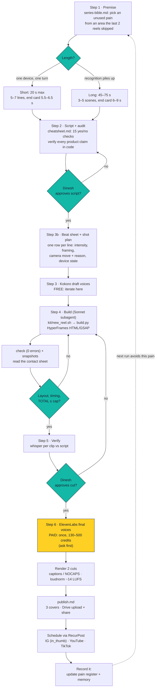

# agency-reel: pipeline flowchart

Renders on GitHub (Mermaid). Source of truth: `.claude/skills/agency-reel/SKILL.md`.

## How to read it

- **Teal diamonds** are decision points. Two are human approvals (script, cut), and the loops
  go back before any money is spent.
- **Yellow** is the only step that costs real money (ElevenLabs). Everything before it uses free Kokoro voices.
- **The dotted arrow** is why the pain register matters: each shipped reel marks its pain as used,
  so the next run starts from a different area of agency life.

## Who does what

| Stage | Where it runs |
|---|---|
| Steps 1, 2, 3b, review of snapshots | Main session (premise, writing, taste) |
| Steps 3, 4 (Kokoro, build, check, snapshots, render) | Sonnet subagent, from the kit (cheaper) |
| Step 6 | Main session, only with approval |
